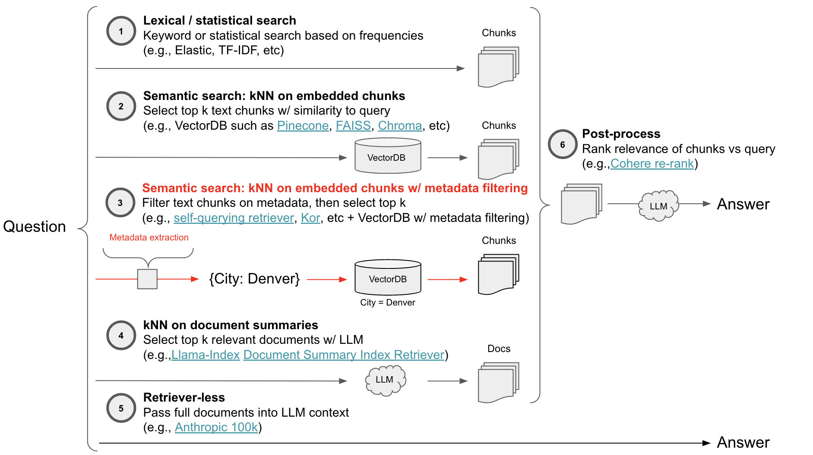

# Auto-Evaluation of Metadata Filtering

[Lance Martin](https://twitter.com/RLanceMartin) 

### Introduction

Q+A systems often use a two-step approach: retrieve relevant text chunks and then synthesize them into an answer. There many ways to approach this. For example, we recently [discussed](https://blog.langchain.dev/auto-evaluation-of-anthropic-100k-context-window/) the Retriever-Less option (at bottom in the below diagram), highlighting the Anthropic 100k context window model. Metadata filtering is an alternative approach that pre-filters chunks based on a user-defined criteria in a VectorDB using metadata tags prior to semantic search.  



### Motivation

I [previously built](https://twitter.com/RLanceMartin/status/1637852936238956546?s=20) a [QA app](https://lex-gpt.vercel.app/) based on the Lex Fridman podcast. This uses semantic search on Pinecone. However, it [failed](https://twitter.com/RLanceMartin/status/1639286900270964737?s=20) in cases where a user wanted to retrieve information about a specific episode (e.g., `summarize episode 53`) or in cases where a guest had been in multiple times and a user wanted information for a particular episode (e.g., `what did Elon say in episode 252`). 

In these cases, semantic search will look for the concept `episode 53` in the chunks, but instead we simply want to filter the chunks for `episode 53` and then perform semantic search to extract those that best summarize the episode. Metadata filtering does this, so long as we 1) we have a metadata filter for episode number and 2) we can extract the value from the query (e.g., `54` or `252`) that we want to extract. The LangChain `SelfQueryRetriever` does the latter (see [docs](https://www.notion.so/Auto-Evaluation-of-Metadata-Filtering-5e3aff0fd1a04b8286b63dc64c8392c5?pvs=21)), [splitting the user input](https://twitter.com/hwchase17/status/1656791490922967041?s=20) into a semantic query and a metadata filter (for [Pinecone](https://python.langchain.com/en/latest/modules/indexes/retrievers/examples/self_query.html) or [Chroma](https://python.langchain.com/en/latest/modules/indexes/retrievers/examples/chroma_self_query.html)).

### Evaluation

We previously introduced [auto-evaluator](https://blog.langchain.dev/auto-evaluator-opportunities/), an open-source tool for grading LLM question-answer chains. Here, we extend auto-evaluator with a [lightweight Streamlit app](https://github.com/langchain-ai/auto-evaluator/tree/main/streamlit) that can connect to any existing Pinecone index. We add the ability to test metadata filtering using `SelfQueryRetriever` as well as some other approaches that we’ve found to be useful, as discussed below.

[ret_trim.mov](images/ret_trim.mov)

### Testing

`SelfQueryRetriever` works well in [many cases](https://twitter.com/hwchase17/status/1656791488569954304/photo/1). For example, given [this test case](https://twitter.com/hwchase17/status/1656791488569954304?s=20):


The query can be nicely broken up into semantic query and metadata filter:

```python
semantic query: "prompt injection"
metadata filter: "webinar_name=agents in production"
```

But, sometimes the metadata filter is not obvious based on the natural language in the question. For example, my [Lex-GPT](https://lex-gpt.vercel.app/) app used an episode ID tag derived from my initial scrape of the [Karpathy transcriptions](https://karpathy.ai/lexicap/index.html), e.g., I have `“0252”` for episode `252`. This means that the retriever will need to perform this translation step, as shown in the diagram below. 


`SelfQueryRetriever` will infer metadata filters from the query using `metadata_field_info`, which you can supply to the auto-evaluator [here](https://github.com/langchain-ai/auto-evaluator/blob/main/streamlit/self_query_retriever_lex.py). To address the above translation, we also test [kor](https://eyurtsev.github.io/kor/tutorial.html), a library for structured data extraction using an LLM. Using Kor, we can explicitly specify a transformation (e.g., `252` to `“0252”`) that the auto-evaluator will use in retrieval [here](https://github.com/langchain-ai/auto-evaluator/blob/main/streamlit/kor_retriever_lex.py).

Below, we can see detailed results from the app:

- Kor extraction is above to perform the transformation between query and metadata format ✅
- Self-querying attempts to filter using the episode ID (`252`) in the query and fails 🚫
- Baseline returns docs from 3 different episodes (one from `252`), confusing the answer 🚫

### Conclusion

Metadata filtering is a useful and powerful augmentation for semantic search. Extracting the metadata filter from the natural language query is a challenge. The `SelfQueryRetriever` does this well in many cases, but other LangChain integrations, such as Kor, can he very useful in cases where the filter definition is not obvious from the natural language query alone.

### Appendix

Detailed results from the [Lex-GPT](https://lex-gpt.vercel.app/) app.

|  | Question | Correct Answer | Generated Answer | Answer Grading | Retrieval Grading | Latency |
| --- | --- | --- | --- | --- | --- | --- |
| Pinecone | What does Elon Musk say about the self driving problem in episode 252? | Elon mentions that the self-driving problem is harder than he thought because you need to build a silicon equivalent of vision that maps from camera to vector space. But, he also mentions that the disengagements has been dropping rapidly and the probability of an accident on FSD will be less than that of the average human within a year. | In episode 252 of the Lex Fridman podcast, Elon Musk discusses the self-driving problem and is impressed by what the Tesla Autopilot team is doing. They are using multitask learning to study the problem of driving and are formulating over a hundred tasks to perceive. They are deploying it and getting data back from people that run into trouble and are trying to figure out if they should add tasks or focus on each individual task separately. Musk acknowledges that there may be a long-term solution involving fancy self-supervised learning, but there is pressure to take shortcuts due to the need to solve engineering problems in a relatively short time. | "1. Relevance: The student's answer does refer to Elon Musk discussing the self-driving problem in episode 252 of the Lex Fridman podcast. However, the details provided in the student's answer do not match the true answer's content.2. Conciseness: The student's answer is not concise, as it provides a lot of information that is not directly related to the true answer.3. Correct: The student's answer is not correct, as it does not mention the key points from the true answer, such as the difficulty of building a silicon equivalent of vision and the rapid decrease in disengagements. Incorrect" | "GRADE: Correct JUSTIFICATION: All three documents contain information about Elon Musk, Tesla Autopilot, and self-driving technology. They also include discussions from the Lex Fridman Podcast, where the specific episode (252) is mentioned. These documents provide context and information that will help the student arrive at the correct answer to the question." | 12.05227709 |
| Self-querying | What does Elon Musk say about the self driving problem in episode 252? | Elon mentions that the self-driving problem is harder than he thought because you need to build a silicon equivalent of vision that maps from camera to vector space. But, he also mentions that the disengagements has been dropping rapidly and the probability of an accident on FSD will be less than that of the average human within a year. | I'm sorry, I cannot provide an answer as there is no information about the specific episode mentioned. | "1. The first criterion is relevance, which asks if the submission refers to a real quote from the text. The student answer does not provide any information about Elon Musk's statement in episode 252, so it does not meet this criterion.2. The second criterion is conciseness, which asks if the answer is concise and to the point. The student answer is concise, but it does not provide any relevant information about the self-driving problem mentioned by Elon Musk.3. The third criterion is correctness, which asks if the answer is correct. The student answer does not provide any information about Elon Musk's statement, so it is not correct.Based on the reasoning above, the submission does not meet the criteria. Incorrect" | "GRADE: Incorrect JUSTIFICATION: There is only one document retrieved, and it does not contain any information related to the question. Therefore, the student cannot arrive at the correct answer using this document." | 7.095044136 |
| Kor Filtering | What does Elon Musk say about the self driving problem in episode 252? | Elon mentions that the self-driving problem is harder than he thought because you need to build a silicon equivalent of vision that maps from camera to vector space. But, he also mentions that the disengagements has been dropping rapidly and the probability of an accident on FSD will be less than that of the average human within a year. | Elon Musk says that the self-driving problem is harder than he initially thought and that to solve it, they need to recreate what humans do to drive, which is to drive with optical sensors and biological neural nets. They need to recreate that in digital form, which means cameras with advanced neural nets in silicon form. The only way to solve for full self-driving is to do this. He also mentions that the rate of disengagements has been dropping rapidly, and it looks like the probability of an accident on FSD is less than that of the average human and significantly less than before. It is looking quite likely that they will solve level four FSD next year. | "1. The student answer refers to Elon Musk's statement about the self-driving problem being harder than he initially thought, which is mentioned in the true answer.2. The student answer also discusses the need to recreate human driving using optical sensors and biological neural nets in digital form, which is related to building a silicon equivalent of vision mentioned in the true answer.3. The student answer mentions the rate of disengagements dropping rapidly and the probability of an accident on FSD being less than that of the average human, which is also mentioned in the true answer.4. The student answer adds information about solving level four FSD next year, which is not mentioned in the true answer but is still relevant to the self-driving problem.5. The student answer is not as concise as the true answer, but it covers the main points and provides additional relevant information. Correct" | "GRADE: Correct JUSTIFICATION: All three documents contain information about Elon Musk's thoughts on self-driving technology and its progress. Specifically, Doc 2 provides a direct answer to the question, mentioning the difficulty of the problem and the improvements in disengagements." | 14.81295681 |